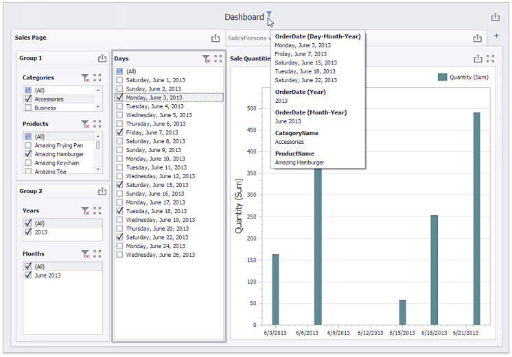

<!-- default badges list -->

<!-- default badges end -->
# Dashboard for WinForms - How to Create a Cascading Lookup Filter and Apply it Across Tab Pages and Data Sources

This example demonstrates a dashboard that implements the cascading filter functionality extended across tab pages and applied to different data sources.

The following techniques are employed:

* [Master filter](https://docs.devexpress.com/Dashboard/15702/creating-dashboards/creating-dashboards-in-the-winforms-designer/interactivity/master-filtering) settings used to create a [cascading lookup filter](https://docs.devexpress.com/Dashboard/400444/creating-dashboards/creating-dashboards-in-the-winforms-designer/interactivity/cascading-lookup)
* [Tab page](https://docs.devexpress.com/Dashboard/400237/creating-dashboards/creating-dashboards-in-the-winforms-designer/designing-dashboard-items/tab-container) interactivity settings to isolate master filter items
* [Master filter settings](https://docs.devexpress.com/Dashboard/15702/creating-dashboards/creating-dashboards-in-the-winforms-designer/interactivity/master-filtering#master-filter-settings) applied to different data sources

The [Cascading Lookup With Master Filters](https://docs.devexpress.com/Dashboard/400444/winforms-dashboard/winforms-designer/create-dashboards-in-the-winforms-designer/interactivity/cascading-lookup) document describes how to create a five-level cascading filter.

The filter and the Chart item with filtered data are located in a tab page. The tab page's **Master Filter** and **Ignore Master Filters** options are enabled to isolate tab page's items from external filters.

Another tab page in a tab container has the **Master Filter** and **Ignore Master Filters** options disabled. The first page's items affect this pages items, and establishes a one-way filter relationship because items on this page cannot filter items on the first page.

The chart on the second page displays data from another data source. That data source's _ProductName_ field matches the name of the field in the first data source, and cascade filtering on the first page can extend to the second page if you enable the **Cross-Data-Source Filtering** option for the _ProductName_ filter element and all filter elements at the lower levels.

The dashboard is shown below.

## Documentation

- [Cascading Lookup With Master Filters](https://docs.devexpress.com/Dashboard/400444/winforms-dashboard/winforms-designer/create-dashboards-in-the-winforms-designer/interactivity/cascading-lookup)
- [Master Filtering](https://docs.devexpress.com/Dashboard/116912)
- [Tab page](https://docs.devexpress.com/Dashboard/400237/creating-dashboards/creating-dashboards-in-the-winforms-designer/designing-dashboard-items/tab-container)
